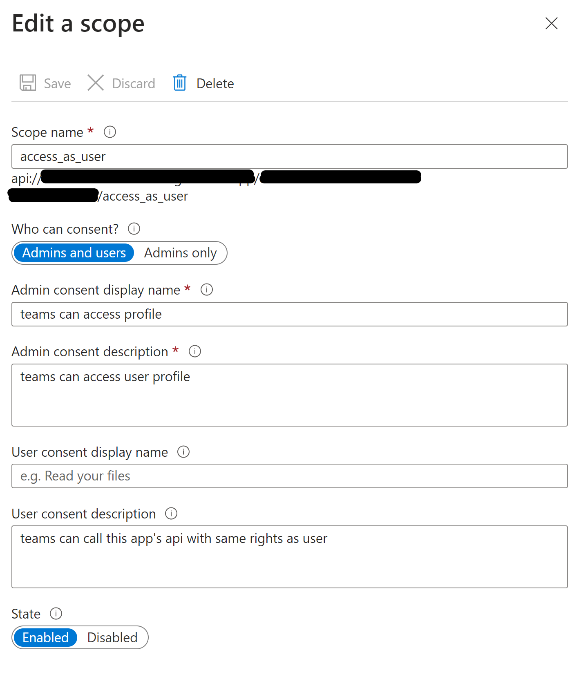

# sample-proj - Microsoft Teams App

Generate a Microsoft Teams application.

TODO: Add your documentation here

## Getting started with Microsoft Teams Apps development

Head on over to [Microsoft Teams official documentation](https://developer.microsoft.com/en-us/microsoft-teams) to learn how to build Microsoft Teams Tabs or the [Microsoft Teams Yeoman generator docs](https://github.com/PnP/generator-teams/docs) for details on how this solution is set up.

## Project setup

All required source code are located in the `./src` folder:

* `client` client side code
* `server` server side code
* `public` static files for the web site
* `manifest` for the Microsoft Teams app manifest

For further details see the [Yo Teams documentation](https://github.com/PnP/generator-teams/docs)

# Running the application in browser and Teams group tab

## Run the gulp commands to see the application running 

*First, in order to just run the application as a stand-alone web app, run the following commands

``` bash
npm install
gulp serve --debug
```
You should be able to go to localhost:3007 and see the running application. Go to localhost:3007/SampleTab to see what the tab app looks like in the Web. Note that since this is not in Teams yet, most fields would show as 'undefined'. This is in debug mode, so if you make a change and press save, you should see the webpage automatically reload with the changes.

## Install a tunneling service such as ngrok/devtunnels

* [Download devtunnel](https://learn.microsoft.com/en-us/azure/developer/dev-tunnels/get-started?tabs=windows)
``` bash
devtunnel user login
devtunnel host -p 3007 --allow-anonymous
```
After pointing this tunneling service to localhost, if you go to the URL for the tunneling service, you should see the same webpage as what is rendered for localhost:3007. 

## Set up Entra

Follow the steps below, or this [doc](https://learn.microsoft.com/en-us/microsoftteams/platform/tabs/how-to/authentication/tab-sso-register-aad)
* Create an App Registration resource in Azure. Make sure to create this resource in a directory you have Admin permissions for or can receive admin permissions for.
* Copy the application ID in the overview page and paste this for TAB_APP_ID in the .env file
* Go to the 'Expose an API' tab, and click 'Edit' next to Application ID URI. Change this url to the format: api://[YOUR-RUNNING-TUNNEL-SERVICE-URL]/[TAB_APP_ID]. TAB_APP_ID is the ID you just pasted into the .env file. 
* In the Scopes defined by this API section, click 'add a scope' and paste the following fields. 
* Under Authorized client applications, add the following two client IDs, with this scope in the above bullet enabled.
** 1fec8e78-bce4-4aaf-ab1b-5451cc387264
** 5e3ce6c0-2b1f-4285-8d4b-75ee78787346

## Building the manifest

To create the Microsoft Teams Apps manifest, run the `manifest` Gulp task. This will generate and validate the package and finally create the package (a zip file) in the `package` folder. The manifest will be validated against the schema and dynamically populated with values from the `.env` file.

``` bash
gulp manifest
```

## Uploading the manifest to further test in Teams

* Open Teams and on the left pane go to Apps
* On the lower left, you should see a link to 'Manage your apps'. Click this.
* Click 'Upload an app' then 'Custom app'. Here you can go to the package folder under this project to find the zipped manifest package. Select this.
* It will prompt you to add this to a Team; select the team you would like to test this application on, and add it as a tab to a channel.
* You should then see the configuration page for this tab. Click 'Save', then go to the newly added tab to see the application. 

## Update APPLICATION_ID
* Make sure to update the APPLICATION_ID in the .env file to a unique ID.

# Other options enabled on this project

## Building the app

The application is built using the `build` Gulp task.

``` bash
npm i -g gulp-cli
gulp build
```

## Deploying the manifest

Using the `yoteams-deploy` plugin, automatically added to the project, deployment of the manifest to the Teams App store can be done manually using `gulp tenant:deploy` or by passing the `--publish` flag to any of the `serve` tasks.

## Configuration

Configuration is stored in the `.env` file.

## Debug and test locally

To debug and test the solution locally you use the `serve` Gulp task. This will first build the app and then start a local web server on port 3007, where you can test your Tabs, Bots or other extensions. Also this command will rebuild the App if you change any file in the `/src` directory.

``` bash
gulp serve
```

To debug the code you can append the argument `debug` to the `serve` command as follows. This allows you to step through your code using your preferred code editor.

``` bash
gulp serve --debug
```

## Useful links

* [Debugging with Visual Studio Code](https://github.com/pnp/generator-teams/blob/master/docs/docs/user-guide/vscode.md)
* [Developing with ngrok](https://github.com/pnp/generator-teams/blob/master/docs/docs/concepts/ngrok.md)
* [Developing with Github Codespaces](https://github.com/pnp/generator-teams/blob/master/docs/docs/user-guide/codespaces.md)

## Additional build options

You can use the following flags for the `serve`, `ngrok-serve` and build commands:

* `--no-linting` or `-l` - skips the linting of Typescript during build to improve build times
* `--debug` - builds in debug mode and significantly improves build time with support for hot reloading of client side components
* `--env <filename>.env` - use an alternate set of environment files
* `--publish` - automatically publish the application to the Teams App store

## Deployment

The solution can be deployed to Azure using any deployment method.

* For Azure Devops see [How to deploy a Yo Teams generated project to Azure through Azure DevOps](https://www.wictorwilen.se/blog/deploying-yo-teams-and-node-apps/)
* For Docker containers, see the included `Dockerfile`

## Logging

To enable logging for the solution you need to add `msteams` to the `DEBUG` environment variable. See the [debug package](https://www.npmjs.com/package/debug) for more information. By default this setting is turned on in the `.env` file.

Example for Windows command line:

``` bash
SET DEBUG=msteams
```

If you are using Microsoft Azure to host your Microsoft Teams app, then you can add `DEBUG` as an Application Setting with the value of `msteams`.
